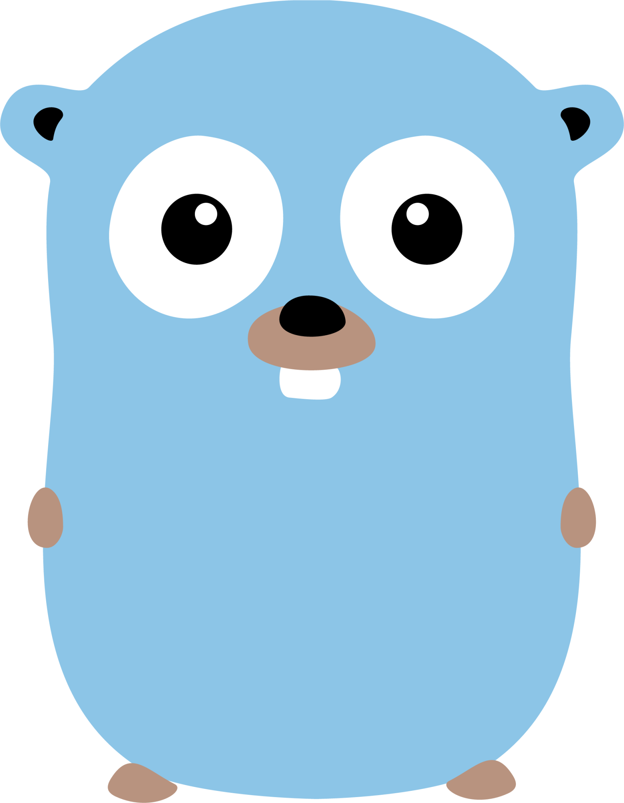
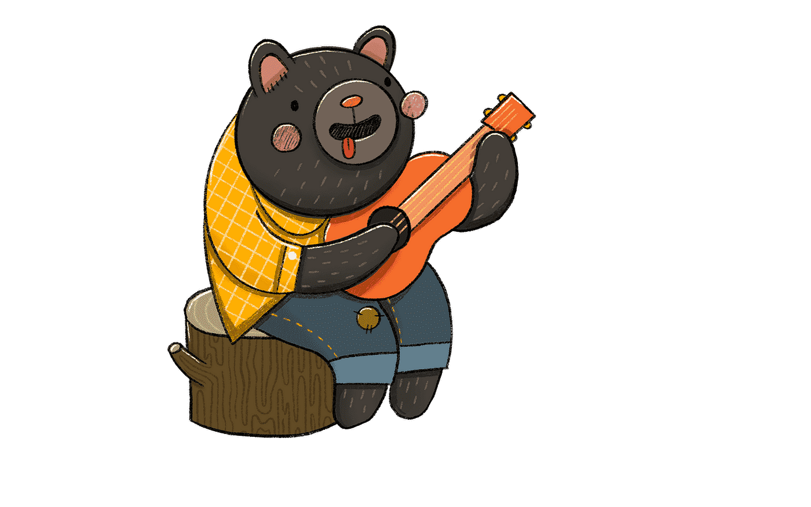

  

# Hi 👋, I'm Ilya

### Full Stack Engineer from Russian Federation

### Student IT from Komi Republic, Ukhta

---

## 💬 Ask me about

  

- Solve programming problems 

- Watch anime or read manga 

- Learn something new every day 

## 📅 Hobbies

### Every day you need to become better

---

## 💻 My Backend Stack

  
  
  

---

## 💻 My Frontend Stack

  
  
  
  
  
  
  
  

