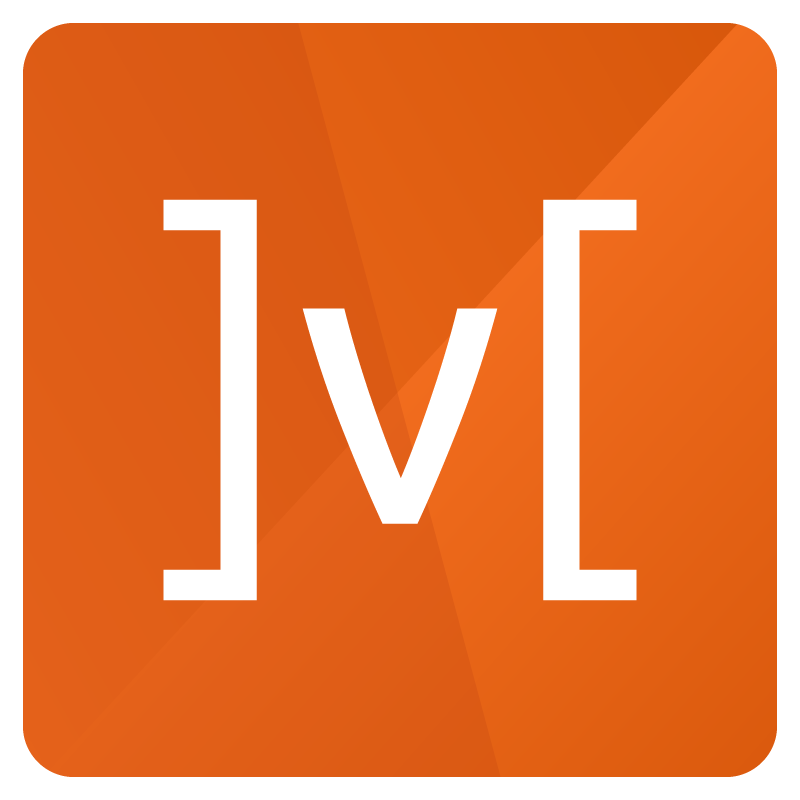

  

<h1 align="center">Hi 👋, I'm Ilya</h1>
<h3 align="center">A software engineer from Russian Federation</h3>
<h3 align="center">Student IT from Komi Republic, Ukhta</h3>

## 💬 Ask me about

- Backend web development
- Frontend web development
- Clean Code
- Design Patterns

## 📅 Hobbies

- Solve programming problems
- Watch anime or read some mange
- Everyday learn something new

<h3 align="center">Every day you need to become better</h3>

## 💻 My backend stack

## 💻 My frontend stack

